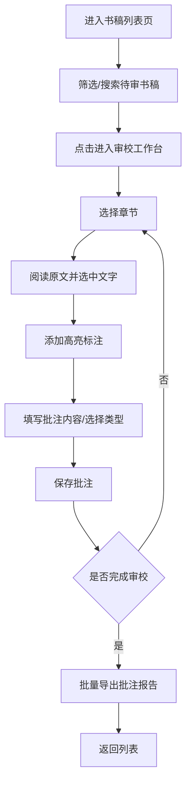

## 1. 产品概述

电子书稿审校工作台是面向出版编辑人员的专业审校工具，提供高效、直观的逐页书稿审校体验，支持高亮标注、分类批注、进度追踪与报告导出。

- 目标用户：出版社编辑、校对人员、内容审核团队
- 核心价值：提升审校效率，标准化批注流程，便于后续修订追踪

## 2. 核心功能

### 2.1 用户角色
| 角色 | 登录方式 | 核心权限 |
|------|----------|----------|
| 编辑 | 系统登录 | 查看待审书稿、逐页审校、添加/编辑/删除批注、导出报告、查看审校进度 |

### 2.2 功能模块
1. **书稿列表页**：待审书稿卡片列表、搜索、状态筛选
2. **审校工作台页**：左侧原文显示区（支持高亮）、右侧批注面板、章节导航、进度条、工具栏

### 2.3 页面详情
| 页面名称 | 模块名称 | 功能描述 |
|---------|----------|----------|
| 书稿列表页 | 顶部导航栏 | Logo、用户信息、搜索框、状态筛选器 |
| 书稿列表页 | 书稿卡片列表 | 显示书名、作者、章节数、审校进度、状态、进入审校按钮 |
| 审校工作台页 | 章节导航侧栏 | 章节树形列表、按章节筛选、进度统计 |
| 审校工作台页 | 原文显示区 | 分页展示原文、文本选择高亮、高亮区域点击查看关联批注 |
| 审校工作台页 | 批注面板 | 批注列表、新增批注、编辑批注、删除批注、批注类型标签、批注筛选 |
| 审校工作台页 | 顶部工具栏 | 返回列表、书稿信息、当前章节、审校进度条、导出按钮 |

## 3. 核心流程

编辑从书稿列表选择待审书稿进入审校工作台，通过左侧阅读原文并选中文字添加高亮标注，在右侧批注面板填写批注内容与类型，可随时按章节筛选查看批注，审校完成后批量导出批注报告。

## 4. 用户界面设计

### 4.1 设计风格
- **主色调**：深邃墨蓝 #1e3a5f 作为主色，搭配书卷米白 #faf6f0 背景，营造专业出版氛围
- **辅助色**：批注类型三色区分：文字错误 #e74c3c（红）、排版问题 #f39c12（橙）、内容疑问 #3498db（蓝）
- **按钮风格**：圆角 6px，实心主色按钮配白色文字，次要按钮采用描边样式
- **字体**：标题使用 "Noto Serif SC" 衬线字体体现书香气质，正文使用 "Noto Sans SC" 保障可读性
- **布局风格**：三栏式布局（章节导航 + 原文区 + 批注面板），卡片化设计，适度留白
- **图标风格**：线性简洁图标，统一 1.5px 线宽

### 4.2 页面设计概览
| 页面名称 | 模块名称 | UI 元素 |
|---------|----------|---------|
| 书稿列表页 | 顶部导航栏 | 深色背景、衬线字体 Logo、圆角搜索框、胶囊状筛选标签 |
| 书稿列表页 | 书稿卡片 | 米白卡片底、细边框、左上色条标识状态、圆形进度环、悬浮阴影动效 |
| 审校工作台页 | 章节导航侧栏 | 窄侧栏、缩进树形结构、当前章节高亮、章节进度圆点 |
| 审校工作台页 | 原文显示区 | 类纸张质感背景、衬线大字号正文、行高 1.8、高亮色随批注类型区分 |
| 审校工作台页 | 批注面板 | 卡片式批注条目、彩色类型标签、可折叠、悬浮出现操作按钮 |
| 审校工作台页 | 顶部工具栏 | 固定顶部、半透明磨砂、渐变进度条、导出按钮带下拉选项 |

### 4.3 响应式
- 桌面端优先（≥1280px）：三栏完整布局
- 平板端（768px–1279px）：章节导航可折叠为抽屉，原文区与批注面板左右分栏
- 移动端（<768px）：上下布局，原文区在上，批注面板在下可展开收起，章节导航采用底部抽屉

### 4.4 交互动效
- 页面加载：元素淡入 + 轻微位移动画，错落延迟
- 高亮添加：选中文字后弹出批注工具条，带缩放过渡
- 批注展开：高度过渡动画
- 卡片悬浮：轻微上移 + 阴影加深
- 进度更新：进度条平滑过渡动画
