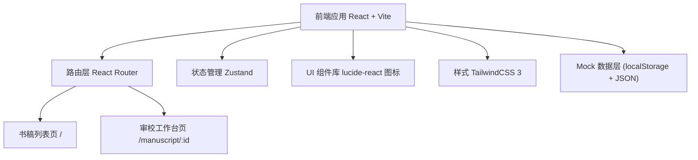
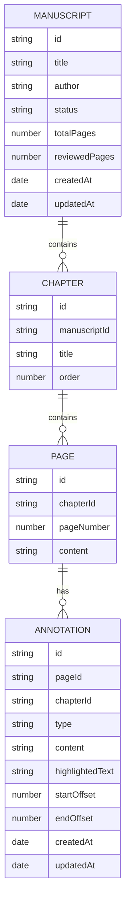

## 1. 架构设计



## 2. 技术说明

- **前端框架**：React@18 + TypeScript
- **构建工具**：Vite@5
- **样式方案**：TailwindCSS@3 + PostCSS
- **路由管理**：react-router-dom@6
- **状态管理**：zustand（轻量状态管理，管理书稿、批注、UI 状态）
- **图标库**：lucide-react（线性简洁图标）
- **数据持久化**：localStorage + Mock 数据（无后端，使用前端模拟）
- **导出功能**：前端生成 CSV / JSON 报告

## 3. 路由定义

| 路由 | 页面用途 |
|------|----------|
| `/` | 书稿列表页：展示所有待审书稿，支持搜索筛选 |
| `/manuscript/:id` | 审校工作台页：逐页审校主界面 |

## 4. 数据模型

### 4.1 实体关系



### 4.2 TypeScript 类型定义

```typescript
type AnnotationType = 'text_error' | 'format_issue' | 'content_question';

interface Manuscript {
  id: string;
  title: string;
  author: string;
  status: 'pending' | 'in_progress' | 'completed';
  totalPages: number;
  reviewedPages: number;
  chapters: Chapter[];
  createdAt: string;
  updatedAt: string;
}

interface Chapter {
  id: string;
  title: string;
  order: number;
  pages: Page[];
}

interface Page {
  id: string;
  chapterId: string;
  pageNumber: number;
  content: string;
}

interface Annotation {
  id: string;
  pageId: string;
  chapterId: string;
  manuscriptId: string;
  type: AnnotationType;
  content: string;
  highlightedText: string;
  startOffset: number;
  endOffset: number;
  createdAt: string;
  updatedAt: string;
}
```

## 5. 项目目录结构

```
src/
├── components/
│   ├── layout/
│   │   ├── Header.tsx
│   │   └── Sidebar.tsx
│   ├── manuscript/
│   │   ├── ManuscriptCard.tsx
│   │   ├── ManuscriptList.tsx
│   │   └── ManuscriptFilter.tsx
│   ├── editor/
│   │   ├── ChapterNav.tsx
│   │   ├── ContentViewer.tsx
│   │   ├── AnnotationPanel.tsx
│   │   ├── AnnotationItem.tsx
│   │   ├── AnnotationForm.tsx
│   │   ├── ProgressBar.tsx
│   │   ├── Toolbar.tsx
│   │   └── ExportMenu.tsx
│   └── ui/
│       ├── Button.tsx
│       ├── Input.tsx
│       ├── Badge.tsx
│       ├── Modal.tsx
│       └── Dropdown.tsx
├── pages/
│   ├── ManuscriptListPage.tsx
│   └── EditorPage.tsx
├── store/
│   ├── manuscriptStore.ts
│   └── annotationStore.ts
├── data/
│   └── mockData.ts
├── types/
│   └── index.ts
├── utils/
│   ├── export.ts
│   └── selection.ts
├── App.tsx
├── main.tsx
└── index.css
```

## 6. 核心实现说明

### 6.1 高亮标注实现
- 使用 `window.getSelection()` 获取用户选中的文本范围
- 通过 `Range` API 计算字符偏移量（startOffset / endOffset）
- 渲染时将原文按偏移量切片，用 `<mark>` 标签包裹高亮文本，不同批注类型使用不同背景色

### 6.2 批注管理
- Zustand store 管理批注列表，支持增删改查
- 按页码 / 章节 / 类型多维筛选
- 点击原文高亮区域联动右侧批注面板定位

### 6.3 导出报告
- 支持导出 CSV 和 JSON 两种格式
- CSV 包含：章节、页码、批注类型、原文摘录、批注内容、创建时间
- 使用 Blob + URL.createObjectURL 触发浏览器下载

### 6.4 进度计算
- 已审校章节数 / 总章节数
- 已批注页数 / 总页数
- 双重维度进度展示
